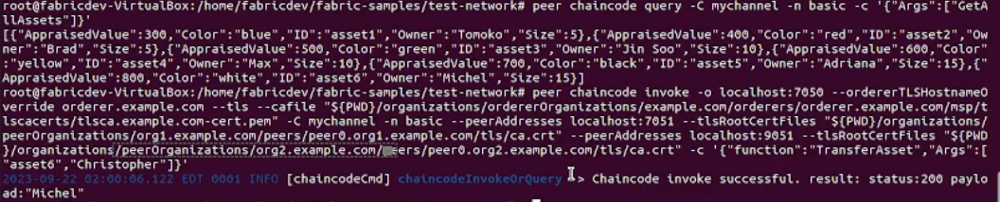
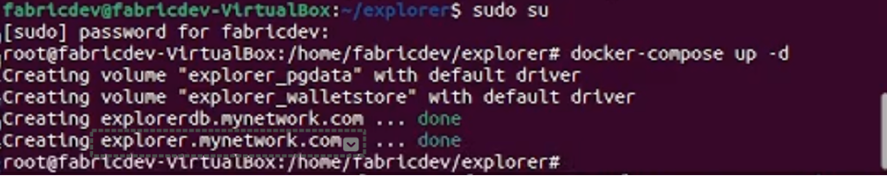

# HYPERLEDGER FABRIC SETUP DOCUMENTATION


## Table of Contents


1. [Introduction](#1-introduction)
    - 1.1 [Overview of Fabric Setup](#11-overview-of-fabric-setup)
    - 1.2 [Purpose and Scope of the Document](#12-purpose-and-scope-of-the-document)
2. [Prerequisites](#2-prerequisites)
    - 2.1 [System Requirements for VirtualBox](#21-system-requirements-for-virtualbox)
3. [Installation and Setup](#3-installation-and-setup)
    - 3.1 [Downloading the OVA File](#31-downloading-the-ova-file)
    - 3.2 [Installing VirtualBox](#32-installing-virtualbox)
    - 3.3 [Importing the Fabric Image](#33-importing-the-fabric-image)
    - 3.4 [Starting the Virtual Machine](#34-starting-the-virtual-machine)
    - 3.5 [Verifying the Setup](#35-verifying-the-setup)
4. [Starting the Blockchain Developer Environment](#4-starting-the-blockchain-developer-environment)
    - 4.1 [Navigating to the Test-Network Directory](#41-navigating-to-the-test-network-directory)
    - 4.2 [Setting Environment Variables](#42-setting-environment-variables)
5. [Network Operations](#5-network-operations)
    - 5.1 [Bringing Up the Network and Creating a Channel](#51-bringing-up-the-network-and-creating-a-channel)
    - 5.2 [Deploying the Chaincode](#52-deploying-the-chaincode)
6. [Chaincode Operations](#6-chaincode-operations)
    - 6.1 [Invoking Chaincode](#61-invoking-chaincode)
    - 6.2 [Querying Chaincode](#62-querying-chaincode)
    - 6.3 [Setting Environment Variables for Org2](#63-setting-environment-variables-for-org2)
    - 6.4 [Chaincode Invocation for Org2](#64-chaincode-invocation-for-org2)
    - 6.5 [Chaincode Query for Org2](#65-chaincode-query-for-org2)
7. [Blockchain Explorer Setup](#7-blockchain-explorer-setup)
    - 7.1 [Accessing the Explorer Folder](#71-accessing-the-explorer-folder)
    - 7.2 [Entering Administrator Mode and Starting the Server](#72-entering-administrator-mode-and-starting-the-server)
    - 7.3 [Accessing the Blockchain Explorer](#73-accessing-the-blockchain-explorer)
8. [Network and Troubleshooting](#8-network-and-troubleshooting)
    - 8.1 [Stopping the Fabric Network](#81-stopping-the-fabric-network)
    - 8.2 [Stopping the Explorer Server](#81-stopping-the-explorer-server)
    - 8.3 [Troubleshooting Tips](#82-troubleshooting-tips)
9. [Chaincode Explanation](#chaincode-explanation)
    - 9.1 [Basic Asset Transfer Use Case](#91-basic-asset-transfer-use-case)
    - 9.2 [Asset Structure](#92-asset-structure)
    - 9.3 [Transferring an Asset](#93-transferring-an-asset)
    - 9.4 [Verifying the Transfer](#94-verifying-the-transfer)

## 1. Introduction

This documentation serves as a comprehensive guide for setting up a blockchain development environment using an open-source platform. It is designed to assist developers and enthusiasts in navigating the complexities of configuring a local blockchain network, providing a sandbox for innovation and exploration in distributed ledger technology.

### 1.1 Overview of Fabric Setup

Hyperledger Fabric, an open-source project from the Linux Foundation, is the modular blockchain framework and de facto standard for enterprise blockchain platforms. Intended as a foundation for developing enterprise-grade applications and industry solutions, the open, modular architecture uses plug-and-play components to accommodate many use cases.

In this documentation, we will explore the necessary components and configurations for setting up a local Hyperledger Fabric network on VirtualBox, which simulates a production-like environment on your machine.

### 1.2 Purpose and Scope of the Document

The purpose of this document is to provide a comprehensive guide for setting up a local Hyperledger Fabric network. It is intended for developers, system administrators, and anyone interested in blockchain technology who wishes to gain hands-on experience with Hyperledger Fabric. We will cover prerequisites, installation procedures, network configurations, and operational commands necessary to get your Fabric network up and running.

By the end of this guide, you should have a fully functional Hyperledger Fabric environment ready for application development and experimentation. Please note that this setup is recommended for development and testing purposes and is not optimized for production use.

## 2. Prerequisites
### 2.1 System Requirements for VirtualBox

Before you begin, make sure your system meets the following minimum requirements:

- Operating System: Windows 10, MacOS, or Linux
- Processor: 64-bit x86 or newer
- Memory: 4GB RAM minimum (8GB recommended)
- Disk Space: At least 20GB of free disk space
- Software: VirtualBox 6.0 or newer

Please note that these are the minimum requirements and actual requirements may vary depending on the specifics of your project and the configuration of your blockchain network.

## 3. Installation and Setup
### 3.1 Downloading the OVA File

The OVA file, which contains the pre-setup Hyperledger Fabric, can be downloaded from the following link:

[Download OVA File](https://wpi0-my.sharepoint.com/:u:/g/personal/rkompella_wpi_edu/EUDdVD8pgF5PqzN292epubcBuVIjl7YlbQgNox7xNk35uw?e=LNiYQl)

After downloading the OVA file, proceed to the next section for instructions on how to import it into VirtualBox.

### 3.2 Installing VirtualBox

VirtualBox is a cross-platform virtualization application that supports all major operating systems. Here's how you can install it:

- Download VirtualBox from the following link: [VirtualBox Downloads](https://www.virtualbox.org/wiki/Downloads)
- Choose the package that corresponds to your operating system (Windows, Linux distributions).
- Open the downloaded file to start the installation process.
- Follow the instructions in the installation wizard. Accept the default settings unless you have specific requirements.
- Once the installation is complete, you should see the VirtualBox Manager on your screen.

    

    

### 3.3 Importing the Fabric Image

- Open VirtualBox and click on "File" in the menu, then select "Import Appliance".
- In the file dialog that opens, navigate to and select the downloaded .ova file to import the fabric image.
- Click "Open", then "Next", and finally "Import" in the Appliance Settings screen.
- Upon successful import, the fabricDev image should be visible in the VirtualBox Manager, as shown below.

    


### 3.4 Starting the Virtual Machine

- Click on the created fabricDev in the VirtualBox Manager and click "Start" to boot up the VM.
- Wait for the image to boot up. When prompted for the password, enter `12345`.
- You should successfully see Ubuntu Linux up and running.

### 3.5 Verifying the Setup

- Once Ubuntu is up and running, open Terminal from the search.
- Enter `ls` and press Enter.
- If you see a list of folders, you have successfully imported the setup onto your local machine.

## 4. Starting the Blockchain Developer Environment

### 4.1 Navigating to the Test-Network Directory

To start the blockchain developer environment, you need to navigate to the `fabric-samples` directory. Open the Terminal in Ubuntu and enter the following commands:

```bash
cd fabric-samples
sudo su
```

After typing `sudo su`, you will be prompted to enter your password. This command switches you to the root user to ensure you have the necessary permissions to execute the scripts in the `fabric-samples` directory.

Once you have successfully switched to the root user, type `ls` and press Enter. You should see the contents of the `fabric-samples` directory as shown in the image below.

  


### 4.2 Setting Environment Variables

Environment variables play a crucial role in configuring the behavior of the Hyperledger Fabric network. If they are not set up correctly, the configuration may not work as expected. In this context, we need to set the environment variables for the current fabric path, config path, certificates, and more. 

When you want to switch from Org1 to Org2, it's important to set the environment variables accordingly. 

Run the following commands from the `fabric-samples/test-network` folder. Replace `Org1` with `org2` in the commands below if you want to execute transactions from Org2.

```bash
export PATH=${PWD}/../bin:$PATH
export FABRIC_CFG_PATH=$PWD/../config/
export CORE_PEER_TLS_ENABLED=true
export CORE_PEER_LOCALMSPID="Org1MSP"
export CORE_PEER_TLS_ROOTCERT_FILE=${PWD}/organizations/peerOrganizations/org1.example.com/peers/peer0.org1.example.com/tls/ca.crt
export CORE_PEER_MSPCONFIGPATH=${PWD}/organizations/peerOrganizations/org1.example.com/users/Admin@org1.example.com/msp
export CORE_PEER_ADDRESS=localhost:7051
```
## 5. Network Operations
### 5.1 Bringing Up the Network and Creating a Channel

In Hyperledger Fabric, a `channel` is a private blockchain overlay which allows for data isolation and confidentiality. A channel is used to host private transactions between a specific set of members.

To bring up the network and create a channel, run the following command from the `fabric-samples/test-network` directory:

```bash
./network.sh up createChannel -c ChannelName

```

Replace `ChannelName` with the name of your channel. This command starts the network and creates a channel with the specified name.

The ./network.sh script is a utility that automates several network operations such as bringing up the network, creating a channel, deploying the chaincode, and more. When you run ./network.sh up, it spins up all the required bootstrap processes, creating two peers, an orderer, and respective organizations.

For more information on the network.sh script, you can refer to the [Hyperledger Fabric Samples GitHub page](https://github.com/hyperledger/fabric-samples/blob/main/test-network/network.sh#L279).


### 5.2 Deploying the Chaincode

After bringing up the network and creating a channel, the next step is to deploy the chaincode. Chaincode is a piece of code that is written in one of the supported languages such as Go, Node.js, or Java. It is installed on the peers and defines the business logic of your blockchain network.

To deploy the chaincode, run the following command from the `fabric-samples/test-network` directory:

```bash
./network.sh deployCC -ccn ChaincodeName -ccp ChaincodePath -ccl ChaincodeLanguage
```
Replace `ChaincodeName` with the name of your chaincode, `ChaincodePath` with the path to your chaincode, and `ChaincodeLanguage` with the language of your chaincode (either go, javascript, or java).

The ./network.sh deployCC command deploys the specified chaincode on the network.

For more information on the network.sh script, you can refer to the [Hyperledger Fabric Samples GitHub page](https://github.com/hyperledger/fabric-samples/blob/main/test-network/network.sh#L337)


## 6. Chaincode Operations

### 6.1 Invoking Chaincode

After the chaincode has been deployed, you can invoke it to interact with the ledger. Invoking chaincode involves calling the chaincode functions to perform various operations like creating, updating, or querying assets.

To invoke the chaincode, use the `peer chaincode invoke` command. Here's a basic example:

```bash
peer chaincode invoke -o localhost:7050 --ordererTLSHostnameOverride orderer.example.com --tls --cafile ${PWD}/organizations/ordererOrganizations/example.com/orderers/orderer.example.com/msp/tlscacerts/tlsca.example.com-cert.pem -C mychannel -n basic --peerAddresses localhost:7051 --tlsRootCertFiles ${PWD}/organizations/peerOrganizations/org1.example.com/peers/peer0.org1.example.com/tls/ca.crt --peerAddresses localhost:9051 --tlsRootCertFiles ${PWD}/organizations/peerOrganizations/org2.example.com/peers/peer0.org2.example.com/tls/ca.crt -c '{"function":"InitLedger","Args":[]}'
```
This command invokes the InitLedger function of the chaincode named basic on the channel mychannel. The --peerAddresses and --tlsRootCertFiles options specify the peers on which the chaincode is to be invoked.

Please replace the channel name, chaincode name, function, and arguments according to your specific use case.

For more information on invoking chaincode, you can refer to the [Hyperledger Fabric Documentation](https://hyperledger-fabric.readthedocs.io/en/latest/commands/peerchaincode.html?highlight=invoke#peer-chaincode-invoke-example).


### 6.2 Querying Chaincode

Once the chaincode has been invoked and the ledger has been updated, you can query the chaincode to retrieve data from the ledger. Querying chaincode involves calling a chaincode function that retrieves data without modifying the ledger.

To query the chaincode, use the `peer chaincode query` command. Here's a basic example:

```bash
peer chaincode query -C mychannel -n basic -c '{"Args":["GetAllAssets"]}'
```
This command queries the `GetAllAssets` function of the chaincode named basic on the channel `mychannel`. The GetAllAssets function is expected to retrieve all assets from the ledger.

Please replace the channel name, chaincode name, and function according to your specific use case.

For more information on querying chaincode, you can refer to the [Hyperledger Fabric Documentation](https://hyperledger-fabric.readthedocs.io/en/latest/commands/peerchaincode.html?highlight=query#peer-chaincode-query-example).


### 6.3 Setting Environment Variables for Org2

If you want to switch to Org2 for querying and verifying the configurations, you need to set the environment variables accordingly. Run the following commands from the `fabric-samples/test-network` folder:

```bash
export CORE_PEER_TLS_ENABLED=true
export CORE_PEER_LOCALMSPID="Org2MSP"
export CORE_PEER_TLS_ROOTCERT_FILE=${PWD}/organizations/peerOrganizations/org2.example.com/peers/peer0.org2.example.com/tls/ca.crt
export CORE_PEER_MSPCONFIGPATH=${PWD}/organizations/peerOrganizations/org2.example.com/users/Admin@org2.example.com/msp
export CORE_PEER_ADDRESS=localhost:9051
```
These commands set the environment variables for Org2. Now, you can query the chaincode as Org2 and verify if all the configurations are in place.

### 6.4 Chaincode Invocation for Org2

After switching to Org2, you can invoke the chaincode as Org2. This allows you to perform transactions as Org2 and interact with the ledger.

To invoke the chaincode as Org2, use the `peer chaincode invoke` command. Here's a basic example:

```bash
peer chaincode invoke -o localhost:7050 --ordererTLSHostnameOverride orderer.example.com --tls --cafile "${PWD}/organizations/ordererOrganizations/example.com/orderers/orderer.example.com/msp/tlscacerts/tlsca.example.com-cert.pem" -C mychannel -n basic --peerAddresses localhost:7051 --tlsRootCertFiles "${PWD}/organizations/peerOrganizations/org1.example.com/peers/peer0.org1.example.com/tls/ca.crt" --peerAddresses localhost:9051 --tlsRootCertFiles "${PWD}/organizations/peerOrganizations/org2.example.com/peers/peer0.org2.example.com/tls/ca.crt" -c '{"function":"TransferAsset","Args":["asset6","Christopher"]}'
```
This command invokes the `TransferAsset` function of the chaincode named `basic` on the channel `mychannel` as Org2. The `TransferAsset` function is expected to transfer an asset to a new owner.

Please replace the channel name, chaincode name, function, and arguments according to your specific use case.




### 6.5 Chaincode Query for Org2

After invoking the chaincode as Org2, you can query the chaincode to verify the changes. This allows you to retrieve data from the ledger as Org2.

To query the chaincode as Org2, use the `peer chaincode query` command. Here's a basic example:

```bash
peer chaincode query -C mychannel -n basic -c '{"Args":["ReadAsset","asset6"]}'
```
This command queries the `ReadAsset` function of the chaincode named `basic` on the channel `mychannel` as Org2. The `ReadAsset` function is expected to retrieve the details of an asset from the ledger.

Please replace the channel name, chaincode name, and function according to your specific use case.


## 7. Blockchain Explorer Setup

Hyperledger Blockchain Explorer is a user-friendly web application that provides a graphical view of the blockchain network. It allows users to perform various operations like querying blocks, transactions, and associated data, network information (name, status, list of nodes), chain codes and transaction families, as well as any other relevant information stored in the ledger.

To set up the Blockchain Explorer and view transactions in a graphical view, follow the steps below:

### 7.1 Accessing the Explorer Folder

Navigate to the explorer folder by running the following commands:

```bash
cd $HOME
cd explorer
```


### 7.2 Entering Administrator Mode and Starting the Server

Once you are in the explorer directory, you need to enter the administrator mode and start the server. Follow the steps below:

```bash
sudo su
```

When prompted, enter the password. In this case, the password is `12345`.

Next, bring up the server using Docker Compose:

```bash
docker-compose up -d
```

This will start the server in detached mode. Now, the Blockchain Explorer should be up and running.




### 7.3 Accessing the Blockchain Explorer

Once the server is up, you can access the Blockchain Explorer by entering `localhost:6363` in your browser. If the following screen is not visible, wait for a couple of minutes, refresh the page, and try again.

To log in, use the following credentials:

- User: `exploreradmin`
- Password: `exploreradminpw`

After logging in, you should be able to view and interact with the blockchain network graphically.


After logging in, if you see the main dashboard of the Blockchain Explorer, it means that the installation setup is complete. You can now interact with the blockchain network graphically and view transactions, blocks, and other relevant information.


## 8. Network and Troubleshooting

This section provides instructions on how to stop the network and some troubleshooting tips.

### 8.1 Stopping the Network

If you encounter any issues with the network, bringing it down and restarting it can often solve the problem. To bring down the blockchain network, navigate to the `fabric-samples/test-network` folder and run the following commands:

```bash
cd fabric-samples/test-network
./network.sh down
```
This will stop all the network components.


### 8.2 Stopping the Explorer Server

If you encounter any issues with the Blockchain Explorer, you can bring it down and restart it. To bring down the explorer server, navigate to the explorer folder and run the following commands:

```bash
cd $HOME/explorer
docker-compose down -v
```


### 8.3 Troubleshooting Tips
If any of the components are not working as expected, try the following:

- Check the logs for any error messages.
- Ensure all the environment variables are set correctly.
- Make sure all the network components are up and running.
- If you made any changes to the configuration files, ensure they are correct and try restarting the network.
- Remember, sometimes, simply stopping and restarting the network can solve many issues.

## 9. Chaincode Explanation

### 9.1 Basic Asset Transfer Use Case

In this use case, assets can be created, read, updated, deleted, and transferred from one owner to another. Each asset has an associated owner, and the owner's identity is verified before performing any operations on the asset.

### 9.2 Asset Structure

Each asset in the basic-asset-transfer chaincode has the following structure:

```json
{
    "ID": "asset6",
    "Color": "blue",
    "Size": 5,
    "Owner": "Michel",
    "AppraisedValue": 300
}
```

### 9.3 Transferring an Asset
To transfer an asset from one owner to another, you need to invoke the chaincode with the `TransferAsset` function. The `TransferAsset` function requires the ID of the asset and the new owner's name as arguments.

Here's an example command to transfer an asset with ID asset6 to a new owner named `Christopher`:
```json
{"function":"TransferAsset","Args":["asset6","Christopher"]}
```

### 9.4 Verifying the Transfer
After transferring the asset, you can query the asset to ensure the `Owner` field has been updated to the new owner:
```bash
peer chaincode query -C mychannel -n basic -c '{"Args":["ReadAsset","asset6"]}
```
